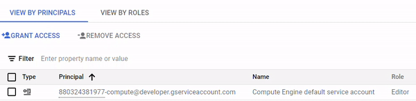

# GCP Project ID Tooltip Extension
This Chrome Extension adds a tooltip with project name over any project number in GCP console webpages.



Google Cloud Console contains several pages where project number (in the form of `123456789012`) is shown. Project numbers (`123456789012`) aren't very human readable, so I wanted to build a chrome extension that would create a tooltip over any string containing the project number. The tooltip text would be the project name.

The extension has been tested and should work on Google Chrome and Microsoft Edge browsers.

# Setup 

In order to function properly, the extension needs to retrieve the list of project ID's / project names in your GCP environments.  The extension uses OAuth2 flow to perform user authentication and client authorization for querying the project ID's / project names. This requires that you configure an OAuth 2.0 Client ID in your GCP. 

The extension does not use [`getAuthToken`](https://developer.chrome.com/docs/extensions/reference/api/identity#method-getAuthToken) API.  This API is [not supported by Microsoft Edge](https://learn.microsoft.com/en-us/microsoft-edge/extensions-chromium/developer-guide/api-support). In order to support both Google Chrome and Microsoft Edge browsers, the extension uses [`launchWebAuthFlow`](https://developer.chrome.com/docs/extensions/reference/api/identity#method-launchWebAuthFlow) API instead.

## Generate Extension ID

In order to generate a consistent extension ID, follow these steps:

- Generate a key:

```bash
openssl genrsa 2048 | openssl pkcs8 -topk8 -nocrypt -out key.pem
```
```bash
openssl rsa -in key.pem -pubout -outform DER | openssl base64 -A
```

This will generate a long base64 encoded string.  You will need this string later for the `manifest.json` file.

- Extension ID:

```bash
openssl rsa -in key.pem -pubout -outform DER | shasum -a 256 | head -c32 | tr 0-9a-f a-p
```

## OAuth consent screen configuration

- In your Google Console, navigate to **APIs & Services**
- Select **OAuth consent screen**
- Complete the first page
  - If you have Google Workspaces, you can make the Application Internal.
  - You will need to add `chromiumapp.org` to **Authorised domains**.  If you don't, it will be automatically added during steps in the next section.
- For scopes, you will need to add Cloud Resource Manager API `./auth/cloudplatformprojects.readonly`
- In the **Test Users** page, you can add any users you wish to have access during testing

## OAuth Client ID Configuration

To configure an OAuth 2.0 Client ID:
- In your Google Console, navigate to **APIs & Services**
- Select **Create Credentials**
- Select **OAuth Client ID**
- Select **Web Application**
  - Do NOT select **Chrome Extension** as we're using `launchWebAuthFlow` API
- Provide a name for the application
- Add an **Authorised redirect URIs**.
  - The URL should be in the form: `https://<YOUR EXTENSION ID>.chromiumapp.org/`
  - Replace the `<YOUR EXTENSION ID>` with the extension ID generated in the previous steps above
- Take a note of the generated **Client ID**. You will need this value later for the `manifest.json` file

## Enable Cloud Resource Manager API

- Cloud Resource Manager API needs to be enabled in your GCP environment. It is required for querying the project IDs / project names.

# Installation

- Download this repository source code
- Edit `gcp-project-tooltip-extension/manifest.json` file:
  - Update the `client_id` key with the value from the [OAuth Client ID Configuration](#oauth-client-id-donfiguration) section
  - Update the `key` key with the base64 value from the [Generate Extension ID](#generate-extension-id) section
- Install the `gcp-project-tooltip-extension` folder as an unpacked extension:
  - Instructions for [Google Chrome](https://developer.chrome.com/docs/extensions/get-started/tutorial/hello-world#load-unpacked)
  - Instructions for [Microsoft Edge](https://learn.microsoft.com/en-us/microsoft-edge/extensions-chromium/getting-started/extension-sideloading)

# Usage

Once the extension is loaded, clicking on the extension icon will toggle extension on/off.

With the extension on, loading any page in Google Console should create a tooltip above any project ID number.

# Issues

I've used / tested this extension in few GCP environments using both Google Chrome and Microsoft Edge. However, it hasn't been tested extensively.  Should you run into any problems, please open an issue with details.